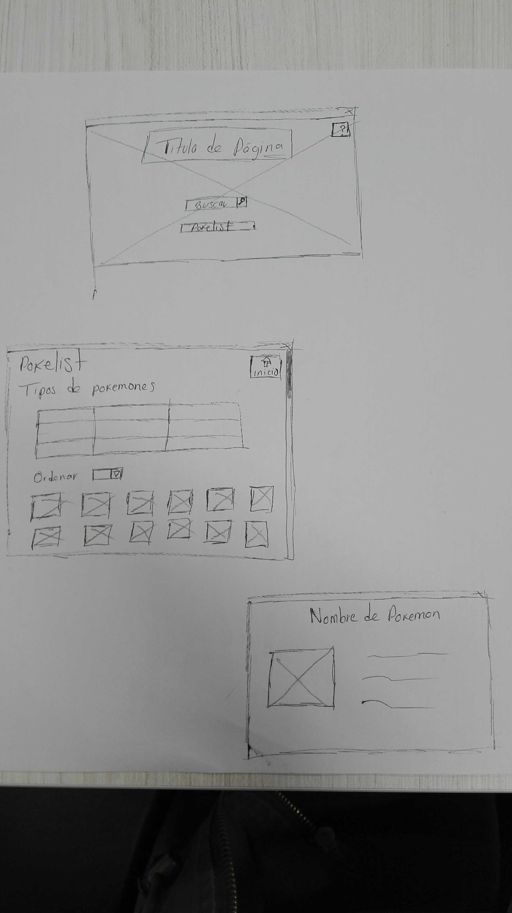
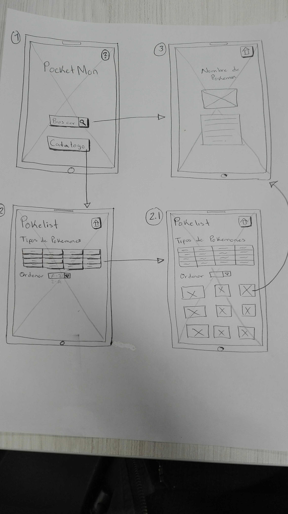
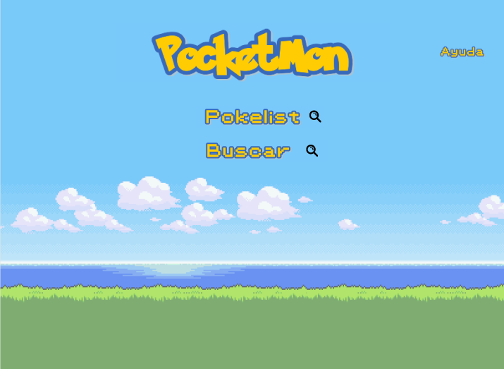
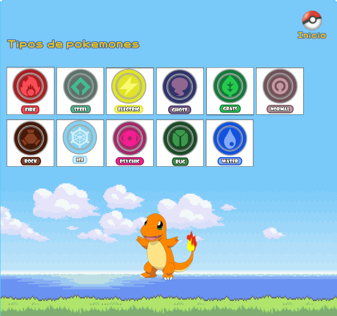
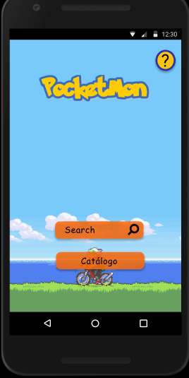
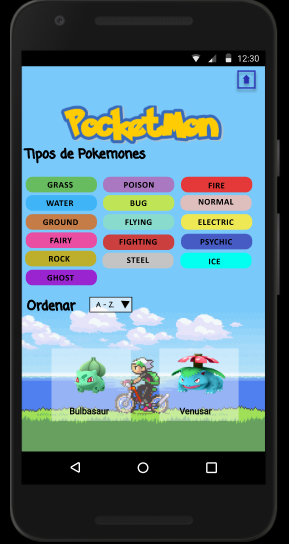
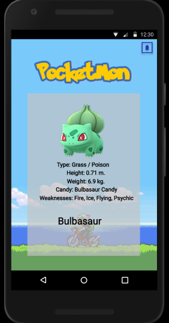

## Parte Obligatoria

Los criterios para considerar que has completado este proyecto son:

### Definición del producto

Nuestro producto fue pensado para niños, niñas y adolescentes entre 9 a 15 años, que les guste y quieran saber más información de cualquier pokémon de la región de Kanto, que cuenten con un dispositivo con internet y que estén interesados en aprender más sobre cada pokémon.

Fue pensado para que fuera fácil e intuitivo para que les facilitará la navegación por el sitio web. Tiene colores atractivos para llamar la atención del usuario y cuenta con pocos botones para hacer más rápido el proceso a la hora de seleccionar su pokémon, se puede filtrar por tipos y cuenta con una sección para cada uno, incluyendo una imagen para hacerlo más visual al igual que están acomodados en un tipo de tarjeta que a la hora de pasar el cursor sobre el pokémon seleccionado se volteará la imagen y mostrará la información.

### Historias de usuario

### Diseño de la Interfaz de Usuario

#### Prototipo de baja fidelidad

#### Prototipo de alta fidelidad

